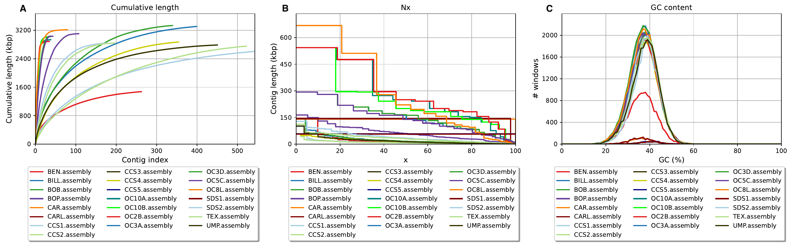
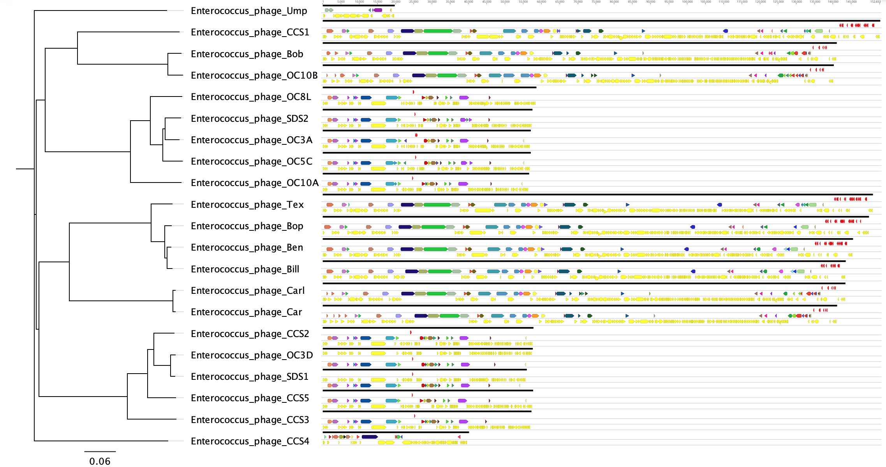
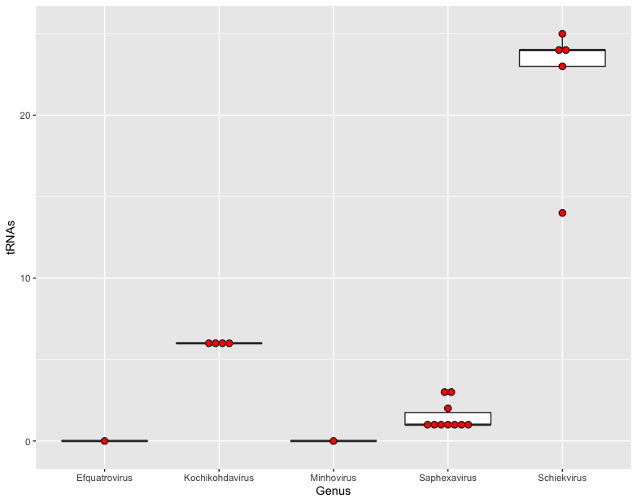

# Project Report
## Genomic Characterization of Phage Candidates for Phage Therapy

### Introduction
Bacterial viruses known as bacteriophages (phages) are the most numerous biological entities on the planet, with an estimated abundance of 1031 phage particles existing throughout the planet.1 Despite the plentiful supply of phages available in nature, and their discovery occurring over 100 years ago, only a select few phages are well studied and characterized.2 In recent years there has been a resurgence in phage research due to the increasing prevalence of multi drug resistant (MDR) bacterial infections. As the effectiveness of antibiotic treatments wane there is an increasing need for additional methods of treating serious bacterial infections. One promising treatment is the use of phages to combat MDR bacterial infections, referred to as phage therapy.3-6 One of the major roadblocks to this method of treatment is that it requires libraries of well characterized phages for use in screening against infectious pathogens, or the rapid isolation of novel phages able to infect specific patient isolates.7 The Whiteson Lab at UC Irvine is actively engaged in phage therapy based research with antibiotic resistant bacteria. We have isolated numerous novel bacteriophages infecting the Enterococcus genus and have sequenced 22 of these phages using Illumina paired-end sequencing. However, relatively few have been fully assembled and annotated in a consistent and reproducible manner. These annotated phages have also not yet been vetted for the presence of antibiotic resistance genes or integrases which may disqualify them from use in phage therapy applications. The aim of this analysis is to generate a robust, mostly automated, pipeline that can be used to analyze newly sequenced phage genomes, describe their basic genomic characteristics, and determine if they are viable candidates for phage therapy focused studies and applications.

### Methods
Phage genomic DNA was extracted from filtered phage lysates using various DNA extraction kits according to the manufacturer's instructions. Sequence libraries were prepared for Illumina paired-end sequencing using the Illumina DNA prep kit following a low volume methodology.8 Libraries were sequenced using either paired-end 75 or paired-end 150 on an Illumina platform at UCI's GHTF. Raw reads were trimmed of adapters, phiX, and low quality bases (< Q30) using BBDuck and duplicate reads removed using Dedupe, both from the BBTools package.9 Human sequence reads were removed from the sequence data files by mapping against the GRCh38 reference genome using the bowtie2 alignment tool and retaining unmapped reads.10,11 Quality reports were generated for raw and cleaned reads using FastQC and aggregate reports generated using MultiQC.12,13 Phage genomes were assembled from cleaned reads using Unicycler.14 Genome assembly statistics reports and figures were generated using Quast and assembly graphs visualized with Bandage.15,16 Phage contigs were extracted from fasta files using Bandage to identify the phage contigs according to coverage and completion. Phage contigs were examined for antimicrobial resistance (AMR) genes using the Resistance Gene Identifier tool (RGI) checking against the Comprehensive Antibiotic Resistance Database (CARD).17 Phage taxonomy was predicted using Kraken2.18 Phage genomes were annotated using the default RASTtk pipeline through the Bacterial and Viral Bioinformatics Resource Center command line interface.19 Annotated genomes were parsed for integrase genes using grep. Genomes were manually inspected and visualized using the Geneious software.20 Geneious was also used to rearrange genomes to start 50 bp upstream of the operon containing the phage terminase gene, as they lack computationally identifiable termini.21,22 Summary statistics of reports were calculated using RStudio.23 Complete datasets, code, generated figures, and reports are available from the [Github repository](https://github.com/eadams762/ee282).

### Results
The number of sequence reads for each file varied greatly due to the variance in sequencing depth obtained from different sequencing runs and will therefore be reported in millions (M) as *mean, median (interquartile range)*. There were 15.6M, 2.3M (35.6M), raw sequence reads. Read trimming removed 21.2%, 20.7% (10.1%) of the raw reads; resulting in 13.1M, 1.8M (30.9M) clean reads per file with an average sequence length of 64 bp. Selected stats from Quast reports of genome assemblies are shown in Table 1 and Quast statistical plots are shown in Figure 1. Complete assembly statistics and Bandage plots of assembly graphs can be found in the [supplementary file](final_project_supplement.md). Phage contigs identified using Bandage were extracted as contig fastas, retaining only the major contig when small unresolved fragments were present. Phage genomes were obtained for all phages except OC2B, however the phage contigs cannot be considered complete genomes due to the tagmentation method used for library preparation, which does not capture the ends of linear phage genomes.

*Table 1. Selected stats from Quast report for all genome assemblies.*
| Assembly | # contigs | Total length | Largest contig | GC (%) | N50    | L50 |
|----------|-----------|--------------|----------------|--------|--------|-----|
| BEN      | 296       | 1483151      | 145346         | 36.60  | 8867   | 37  |
| BILL     | 407       | 3308905      | 143364         | 36.97  | 14538  | 54  |
| BOB      | 347       | 3335849      | 140858         | 36.87  | 16355  | 53  |
| BOP      | 186       | 3121296      | 164134         | 37.17  | 59777  | 17  |
| CAR      | 2         | 141379       | 141012         | 35.84  | 141012 | 1   |
| CARL     | 3         | 146927       | 143298         | 35.86  | 143298 | 1   |
| CCS1     | 553       | 2610253      | 128315         | 38.36  | 7588   | 95  |
| CCS2     | 529       | 2755718      | 57680          | 37.54  | 7423   | 113 |
| CCS3     | 1         | 57062        | 57062          | 39.76  | 57062  | 1   |
| CCS4     | 359       | 2870953      | 58393          | 37.20  | 13232  | 58  |
| CCS5     | 1         | 57572        | 57572          | 40.03  | 57572  | 1   |
| OC10A    | 98        | 2947897      | 544229         | 37.36  | 250827 | 4   |
| OC10B    | 95        | 3031102      | 544229         | 37.23  | 200789 | 5   |
| OC2B     | 89        | 2898158      | 544229         | 37.30  | 250827 | 4   |
| OC3A     | 85        | 3040893      | 293735         | 37.24  | 162174 | 7   |
| OC3D     | 82        | 3042979      | 293732         | 37.24  | 165737 | 7   |
| OC5C     | 79        | 3041168      | 293733         | 37.25  | 138585 | 8   |
| OC8L     | 273       | 3255694      | 668266         | 37.06  | 221260 | 4   |
| SDS1     | 1         | 55807        | 55807          | 39.94  | 55807  | 1   |
| SDS2     | 224       | 2852443      | 99838          | 37.62  | 33782  | 26  |
| TEX      | 222       | 2851131      | 111788         | 38.04  | 29611  | 31  |
| UMP      | 624       | 2827287      | 101897         | 37.86  | 12985  | 54  |

|  |
|----|
|*Figure 1. Statistical plots output by Quast: A) Contiguity plot showing cummulative length of contigs for each assembly. B) Nx plot as x varies from 0 to 100%. C) GC plot showing the distribution of GC content in the assembly contigs.*|

When extracted contigs were assessed for the presence of AMR genes, three phages had a single CARD hit for the same gene, approximately 15.3% of efrA. After annotation, none of the genomes contained an integrase gene nor did they have any complete AMR genes. Taxonomic classification identified each phage as belonging to one of five separate genera and the species classifications were considered to be a closely related phage. A summary of the phage genome characteristics is presented in Table 2. Annotated phage genomes are presented in Figure 2. The number of tRNAs present in each genome was found to be related to the phage genus, as shown in Figure 3, with Schiekvirus phages having significantly more tRNAs than other phage genera.

*Table 2. Phage genome characteristics and taxonomic classification. Protein coding sequences (CDS) are additionally listed as having been functionally annotated or being hypothetical proteins (Annot/Hyp).*
| Phage | Size   | GC   | CDS | (Annot/Hyp) | tRNAs | AMR  | Integrase | Genus           | Closest_Relative               |
|-------|--------|------|-----|-------------|-------|------|-----------|-----------------|--------------------------------|
| Ben   | 145346 | 37.3 | 181 | (32/149)    | 25    | None | No        | Schiekvirus     | Enterococcus phage EFDG1       |
| Bill  | 143364 | 37.1 | 187 | (32/155)    | 14    | None | No        | Schiekvirus     | Enterococcus phage EFDG1       |
| Bob   | 140858 | 35.9 | 210 | (36/174)    | 6     | None | No        | Kochikohdavirus | Kochikohdavirus EF24C          |
| Bop   | 149777 | 37.2 | 189 | (30/159)    | 23    | None | No        | Schiekvirus     | Enterococcus phage EfV12-phi1  |
| Car   | 141012 | 35.8 | 209 | (37/172)    | 6     | None | No        | Kochikohdavirus | Enterococcus phage EFLK1       |
| Carl  | 143298 | 35.9 | 213 | (39/174)    | 6     | None | No        | Kochikohdavirus | Enterococcus phage ECP3        |
| CCS1  | 152832 | 37.2 | 192 | (35/157)    | 24    | None | No        | Schiekvirus     | Enterococcus phage EFP01       |
| CCS2  | 57680  | 39.8 | 102 | (19/83)     | 3     | efrA | No        | Saphexavirus    | Streptococcus phage SP-QS1     |
| CCS3  | 57062  | 39.8 | 99  | (18/81)     | 1     | None | No        | Saphexavirus    | Enterococcus phage VD13        |
| CCS4  | 39995  | 34.9 | 66  | (15/51)     | 0     | None | No        | Efquatrovirus   | Enterococcus phage phiSHEF4    |
| CCS5  | 57572  | 40.0 | 102 | (17/85)     | 1     | efrA | No        | Saphexavirus    | Enterococcus phage SAP6        |
| OC10A | 56483  | 40.0 | 99  | (19/80)     | 1     | efrA | No        | Saphexavirus    | Enterococcus phage IMEEF1      |
| OC10B | 140044 | 35.7 | 199 | (40/159)    | 6     | None | No        | Kochikohdavirus | Enterococcus phage ECP3        |
| OC2B  | n/a    | n/a  | n/a | n/a         | n/a   | n/a  | n/a       | n/a             | n/a                            |
| OC3A  | 56915  | 40.0 | 99  | (18/81)     | 3     | None | No        | Saphexavirus    | Enterococcus phage VD13        |
| OC3D  | 57478  | 40.0 | 101 | (19/82)     | 1     | None | No        | Saphexavirus    | Enterococcus phage IMEEF1      |
| OC5C  | 56957  | 39.7 | 97  | (21/76)     | 1     | None | No        | Saphexavirus    | Enterococcus phage VD13        |
| OC8L  | 58468  | 39.8 | 99  | (16/83)     | 2     | None | No        | Saphexavirus    | Enterococcus phage VD13        |
| SDS1  | 55807  | 39.9 | 96  | (19/77)     | 1     | None | No        | Saphexavirus    | Streptococcus phage SP-QS1     |
| SDS2  | 57384  | 39.8 | 99  | (19/80)     | 1     | None | No        | Saphexavirus    | Enterococcus phage VD13        |
| Tex   | 150857 | 37.2 | 190 | (33/157)    | 24    | None | No        | Schiekvirus     | Enterococcus phage EFP01       |
| Ump   | 19601  | 34.9 | 23  | (6/17)      | 0     | None | No        | Minhovirus      | Enterococcus phage vB_EfaP_Zip |

|  |
|----|
|*Figure 2. Phage genomes arranged to start upstream of the Terminase operon. Genome order is based on nucleic acid similarity as calculated in Genious using the default settings of the Geneious Tree Builder program, with the resulting tree shown on the lefthand side of the plot.*|

|  |
|----|
|*Figure 3. Number of tRNAs present in the genomes of each phage genus.*|

### Discussion
As the prevalence of AMR bacteria and MDR infections increases, the need for new methods of treatment also rises. A recent review of AMR cases in 2019 found that there were nearly 5 million deaths associated with bacterial AMR infections.24 With few new antibacterial agents currently in development, there is a need for methods such as phage therapy to assist in treatment of AMR infections. This project presents a workflow for analyzing novel phage genomes as potential candidates for use in phage therapy studies and research applications, including checks for potential safety risks such as AMR and integrase genes which would cause a phage to be unsuitable for use in phage therapy. This method uses freely available command line tools for the necessary steps of analysis, making it a modular and easily implemented strategy for the initial investigation of phage genomes. There are numerous factors to consider when sequencing phage genomes and it is somewhat beyond the scope of this report to cover, but has been explored in depth by prior works.25 One problematic aspect of sequencing phage genomes is the presence of bacterial host DNA in phage lysate preparations. There are variations of DNA extraction methods that can deplete this host DNA, and this is the recommended method when possible.26 However, in cases where this host DNA depletion has not been performed, such as in this study, it is still possible to identify phage genomes from assembly graphs based on relative coverage. Upon generation of a completed phage genome assembly there are computational methods for determination of phage termini and packing strategies, such as the PhageTerm program, but these methods are only reliable with sequencing of randomly sheared genomic DNA and will not function properly with tagmentation-based or PCR amplified sequence libraries.21 In cases where phage termini cannot be determined it is recommended to arrange genomic start positions relative to a specific gene or operon. In this study genomes were arranged to start upstream of the terminase operon due to its ubiquity in most phage genomes, with only phage Ump lacking a terminase gene among our phages. Genomes are rearranged to allow for more accurate comparisons between related phages, such as in Figure 3.

There are numerous methods for functional annotation of genomes, especially prokaryotic genomes. This study utilizes the standard RASTtk pipeline as it is a robust and well developed set of methods for identifying functional genes and tRNAs.19 It is also easily implemented through either a web portal or command line interface utility. RASTtk generates a consensus of ORF calls using both Prodigal and Glimmer3 gene calling programs, assigns functional annotations using a unique subsystem analysis method, and also identifies tRNAs using the tRNAscan program. One reason that we focus on the presence of tRNAs in our phage genomes here is that prior, unpublished, work out of our lab has shown a correlation between tRNAs and phage host range. Where phages with a greater abundance of tRNAs tend to have a broader host range. This may be a potentially fruitful area of investigation for future studies, as many phages have relatively narrow host ranges, while broad host range phages may be more widely applicable in phage therapy treatments.

Finally, there are the two necessary safety checkpoints within this analysis methodology. The first safety checkpoint when examining novel phage genomes is a search for AMR genes, as it would be unwise to utilize a phage which may introduce new resistances into a bacterial population. We accomplished this initial check with the Resistance Gene Identifier program, which uses BLAST to check for protein homology against the Comprehensive Antibiotic Resistance Database, and amongst our phages only identified three with positive hits to the database.17 These three phages all matched to 15.3% of the erfA gene, which is part of the efrAB antibiotic efflux pump system providing resistance to macrolides, fluoroquinolone, and rifamycin antibiotics. All other phages in the collection had zero CARD hits and are unlikely to contain any AMR genes of concern. As the three phages with a positive hit only contain a small portion of a gene, which is non-functional in the absence of the complementary efrB protein, they have been determined as safe to proceed with. However, the presence of this gene fragment should still be noted in any description of the phages so that they are not utilized against bacteria which contain the efrB gene without further safety studies. The second safety checkpoint is to parse annotated genomes for the presence of an integrase gene. This is necessary as phage therapy attempts to utilize strictly lytic phages, rather than lysogenic phages which can integrate their genomes into a bacterial host's genome.27,28 This reduces the likelihood of introduced phages facilitating the transfer of AMR or virulence genes between bacterial hosts. These two safety checks are vital to the investigation of phage candidates as potentials for therapeutic applications to ensure the health and safety of potential patients.

### References

1. Clokie, M. R., Millard, A. D., Letarov, A. V. & Heaphy, S. Phages in nature. Bacteriophage 1, 31–45 (2011).

2. Bacteriophages. vol. 501 (Humana Press, 2009).

3. Brüssow, H. What is needed for phage therapy to become a reality in Western medicine? Virology 434, 138–142 (2012).

4. Golkar, Z., Bagasra, O. & Pace, D. G. Bacteriophage therapy: a potential solution for the antibiotic resistance crisis. J. Infect. Dev. Ctries. 8, 129–136 (2014).

5. Kortright, K. E., Chan, B. K., Koff, J. L. & Turner, P. E. Phage Therapy: A Renewed Approach to Combat Antibiotic-Resistant Bacteria. Cell Host Microbe 25, 219–232 (2019).

6. Lin, D. M., Koskella, B. & Lin, H. C. Phage therapy: An alternative to antibiotics in the age of multi-drug resistance. World J. Gastrointest. Pharmacol. Ther. 8, 162–173 (2017).

7. Gibson, S. B. et al. Constructing and Characterizing Bacteriophage Libraries for Phage Therapy of Human Infections. Front. Microbiol. 10, (2019).

8. Adams, E., Wandro, S., Avelar-Barragan, J., Oliver, A. & Whiteson, K. Low Volume Methodology for Nextera DNA Flex Library Prep Kit (96 Samples). protocols.io https://www.protocols.io/view/low-volume-methodology-for-nextera-dna-flex-librar-be6rjhd6 (2020).

9. Bushnell B. 2014. BBTools software package. http://bbtools.jgi.doe.gov.

10. Evaluation of GRCh38 and de novo haploid genome assemblies demonstrates the enduring quality of the reference assembly | bioRxiv. https://www.biorxiv.org/content/10.1101/072116v2.

11. Langmead, B. & Salzberg, S. L. Fast gapped-read alignment with Bowtie 2. Nat. Methods 9, 357–359 (2012).

12. Babraham Bioinformatics - FastQC A Quality Control tool for High Throughput Sequence Data. https://www.bioinformatics.babraham.ac.uk/projects/fastqc/.

13. Ewels, P., Magnusson, M., Lundin, S. & Käller, M. MultiQC: summarize analysis results for multiple tools and samples in a single report. Bioinformatics 32, 3047–3048 (2016).

14. Wick, R. R., Judd, L. M., Gorrie, C. L. & Holt, K. E. Unicycler: Resolving bacterial genome assemblies from short and long sequencing reads. PLOS Comput. Biol. 13, e1005595 (2017).

15. Gurevich, A., Saveliev, V., Vyahhi, N. & Tesler, G. QUAST: quality assessment tool for genome assemblies. Bioinformatics 29, 1072–1075 (2013).

16. Wick, R. R., Schultz, M. B., Zobel, J. & Holt, K. E. Bandage: interactive visualization of de novo genome assemblies. Bioinformatics 31, 3350–3352 (2015).

17. Alcock, B. P. et al. CARD 2020: antibiotic resistome surveillance with the comprehensive antibiotic resistance database. Nucleic Acids Res. 48, D517–D525 (2020).

18. Wood, D. E., Lu, J. & Langmead, B. Improved metagenomic analysis with Kraken 2. Genome Biol. 20, 257 (2019).

19. Brettin, T. et al. RASTtk: A modular and extensible implementation of the RAST algorithm for building custom annotation pipelines and annotating batches of genomes. Sci. Rep. 5, 8365 (2015).

20. Geneious | Bioinformatics Software for Sequence Data Analysis. Geneious https://www.geneious.com/.

21. Garneau, J. R., Depardieu, F., Fortier, L.-C., Bikard, D. & Monot, M. PhageTerm: a tool for fast and accurate determination of phage termini and packaging mechanism using next-generation sequencing data. Sci. Rep. 7, 8292 (2017).

22. Li, S. et al. Scrutinizing Virus Genome Termini by High-Throughput Sequencing. PLOS ONE 9, e85806 (2014).

23. RStudio Team (2020). RStudio: Integrated Development for R. RStudio, PBC, Boston, MA http://www.rstudio.com/.

24. Murray, C. J. et al. Global burden of bacterial antimicrobial resistance in 2019: a systematic analysis. The Lancet 399, 629–655 (2022).

25. Russell, D. A. Sequencing, Assembling, and Finishing Complete Bacteriophage Genomes. in Bacteriophages: Methods and Protocols, Volume 3 (eds. Clokie, M. R. J., Kropinski, A. M. & Lavigne, R.) 109–125 (Springer, 2018). doi:10.1007/978-1-4939-7343-9_9.

26. Jakočiūnė, D. & Moodley, A. A Rapid Bacteriophage DNA Extraction Method. Methods Protoc. 1, 27 (2018).

27. Gelman, D. et al. Clinical Phage Microbiology: a suggested framework and recommendations for the in-vitro matching steps of phage therapy. Lancet Microbe 2, e555–e563 (2021).

28. Vandenheuvel, D., Lavigne, R. & Brüssow, H. Bacteriophage Therapy: Advances in Formulation Strategies and Human Clinical Trials. Annu. Rev. Virol. 2, 599–618 (2015).

